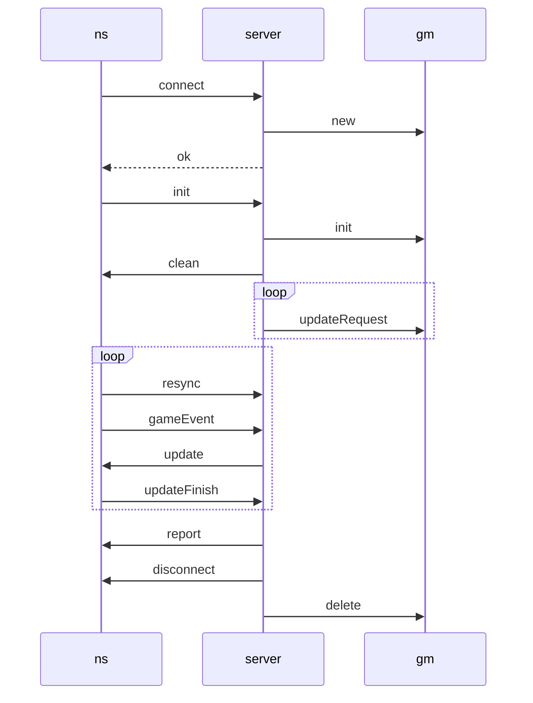

```mermaid
sequenceDiagram
    ns->>server:connect
    server->>gm:new
    server-->>ns:ok
    ns->>server:init
    server->>gm:init
    server->>ns:clean
    loop
        server->>gm:updateRequest
    end
    loop
        ns->>server:resync
        ns->>server:gameEvent
        server->>ns:update
        ns->>server:updateFinish
    end
    server->>ns:report
    server->>ns:disconnect
    server->>gm:delete

```

- 多言語対応
- サーバー
- プロセッサが 1 回しか処理しないようにする
- 両手使えるようにする。
- 地下コンベア
- ショップ
- インベントリ
- セーブデータの読み込み
- セーブデータの書き込み
