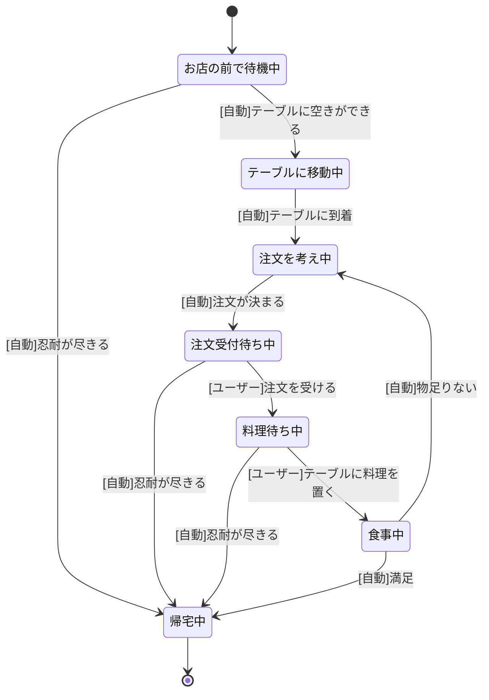

お客さんの状態

- お店の前で待機中
- テーブルに移動中
- 注文を考え中
- 注文受付待ち中
- 料理待ち中
- 食事中
- 帰宅中

```mermaid

stateDiagram
  [*]-->お店の前で待機中
  お店の前で待機中-->テーブルに移動中:[自動]テーブルに空きができる
  お店の前で待機中-->帰宅中:[自動]忍耐が尽きる
  テーブルに移動中-->注文を考え中:[自動]テーブルに到着
  注文を考え中-->注文受付待ち中:[自動]注文が決まる
  注文受付待ち中-->料理待ち中:[ユーザー]注文を受ける
  注文受付待ち中-->帰宅中:[自動]忍耐が尽きる
  料理待ち中-->食事中:[ユーザー]テーブルに料理を置く
  料理待ち中-->帰宅中:[自動]忍耐が尽きる
  食事中-->帰宅中:[自動]満足
  食事中-->注文を考え中:[自動]物足りない
  帰宅中-->[*]
```
