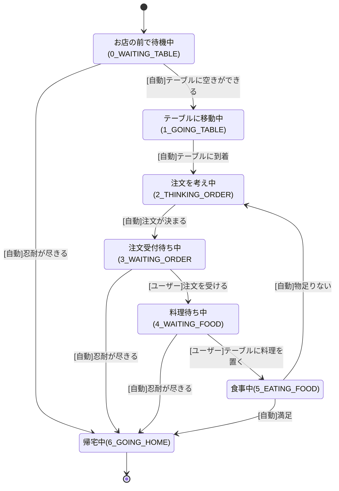

お客さんの状態

- お店の前で待機中
- テーブルに移動中
- 注文を考え中
- 注文受付待ち中(3_WAITING_ORDER
- 料理待ち中(4_WAITING_FOOD)
- 食事中(5_EATING_FOOD)
- 帰宅中(6_GOING_HOME)

```mermaid

stateDiagram
  [*]-->お店の前で待機中(0_WAITING_TABLE)
  お店の前で待機中(0_WAITING_TABLE)-->テーブルに移動中(1_GOING_TABLE):[自動]テーブルに空きができる
  お店の前で待機中(0_WAITING_TABLE)-->帰宅中(6_GOING_HOME):[自動]忍耐が尽きる
  テーブルに移動中(1_GOING_TABLE)-->注文を考え中(2_THINKING_ORDER):[自動]テーブルに到着
  注文を考え中(2_THINKING_ORDER)-->注文受付待ち中(3_WAITING_ORDER:[自動]注文が決まる
  注文受付待ち中(3_WAITING_ORDER-->料理待ち中(4_WAITING_FOOD):[ユーザー]注文を受ける
  注文受付待ち中(3_WAITING_ORDER-->帰宅中(6_GOING_HOME):[自動]忍耐が尽きる
  料理待ち中(4_WAITING_FOOD)-->食事中(5_EATING_FOOD):[ユーザー]テーブルに料理を置く
  料理待ち中(4_WAITING_FOOD)-->帰宅中(6_GOING_HOME):[自動]忍耐が尽きる
  食事中(5_EATING_FOOD)-->帰宅中(6_GOING_HOME):[自動]満足
  食事中(5_EATING_FOOD)-->注文を考え中(2_THINKING_ORDER):[自動]物足りない
  帰宅中(6_GOING_HOME)-->[*]
```
