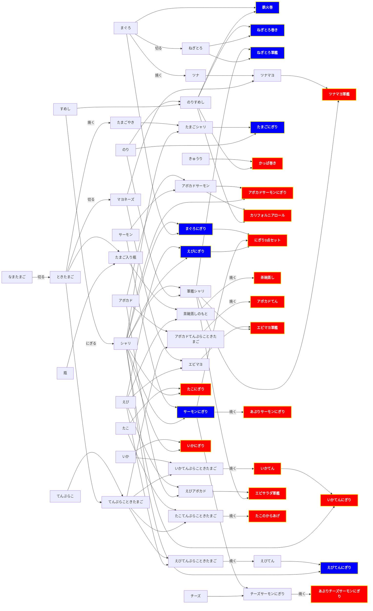

```mermaid
flowchart LR
classDef fin fill:#f00,color:white,font-weight:bold,stroke-width:2px,stroke:yellow
classDef fin2 fill:#00f,color:white,font-weight:bold,stroke-width:2px,stroke:yellow

のり-->のりすめし
すめし-->のりすめし
まぐろ-->B[鉄火巻]
のりすめし-->B[鉄火巻]
まぐろ-->|切る|ねぎとろ
のりすめし-->C[ねぎとろ巻き]
ねぎとろ-->C[ねぎとろ巻き]
すめし-->|にぎる|シャリ
シャリ-->軍艦シャリ
のり-->軍艦シャリ
軍艦シャリ-->A[ねぎとろ軍艦]
ねぎとろ-->A[ねぎとろ軍艦]
シャリ-->D[まぐろにぎり]
まぐろ-->D[まぐろにぎり]
えび-->E[えびにぎり]
シャリ-->E[えびにぎり]
サーモン-->F[サーモンにぎり]
シャリ-->F[サーモンにぎり]
てんぷらこ-->てんぷらこときたまご
ときたまご-->てんぷらこときたまご
てんぷらこときたまご-->えびてんぷらこときたまご
えび-->えびてんぷらこときたまご
えびてんぷらこときたまご-->|焼く|えびてん
えびてん-->G[えびてんにぎり]
シャリ-->G[えびてんにぎり]
なまたまご-->|切る|ときたまご
ときたまご-->|焼く|たまごやき
たまごやき-->たまごシャリ
シャリ-->たまごシャリ
たまごシャリ-->H[たまごにぎり]
のり-->H[たまごにぎり]
きゅうり-->I[かっぱ巻き]
のりすめし-->I[かっぱ巻き]
アボカド-->アボカドサーモン
サーモン-->アボカドサーモン
アボカドサーモン-->K[アボカドサーモンにぎり]
シャリ-->K[アボカドサーモンにぎり]
アボカドサーモン-->L[カリフォルニアロール]
のりすめし-->L[カリフォルニアロール]
D[まぐろにぎり]-->M[にぎり3点セット]
F[サーモンにぎり]-->M[にぎり3点セット]
E[えびにぎり]-->M[にぎり3点セット]
ときたまご-->|切る|マヨネーズ
ときたまご-->たまご入り瓶
瓶-->たまご入り瓶
たまご入り瓶-->茶碗蒸しのもと
えび-->茶碗蒸しのもと
茶碗蒸しのもと-->|焼く|R[茶碗蒸し]
アボカド-->アボカドてんぷらこときたまご
てんぷらこときたまご-->アボカドてんぷらこときたまご
アボカドてんぷらこときたまご-->|焼く|S[アボカドてん]
マヨネーズ-->エビマヨ
えび-->エビマヨ
エビマヨ-->N[エビマヨ軍艦]
軍艦シャリ-->N[エビマヨ軍艦]
まぐろ-->|焼く|ツナ
ツナ-->ツナマヨ
マヨネーズ-->ツナマヨ
ツナマヨ-->O[ツナマヨ軍艦]
軍艦シャリ-->O[ツナマヨ軍艦]
F[サーモンにぎり]-->|焼く|J[あぶりサーモンにぎり]
F[サーモンにぎり]-->チーズサーモンにぎり
チーズ-->チーズサーモンにぎり
チーズサーモンにぎり-->|焼く|P[あぶりチーズサーモンにぎり]
えび-->えびアボカド
アボカド-->えびアボカド
えびアボカド-->Q[エビサラダ軍艦]
軍艦シャリ-->Q[エビサラダ軍艦]
たこ-->T[たこにぎり]
シャリ-->T[たこにぎり]
たこ-->たこてんぷらこときたまご
てんぷらこときたまご-->たこてんぷらこときたまご
たこてんぷらこときたまご-->|焼く|U[たこのからあげ]
いか-->V[いかにぎり]
シャリ-->V[いかにぎり]
いか-->いかてんぷらこときたまご
てんぷらこときたまご-->いかてんぷらこときたまご
いかてんぷらこときたまご-->|焼く|W[いかてん]
W[いかてん]-->X[いかてんにぎり]
シャリ-->X[いかてんにぎり]

class A,B,C,D,E,F,G,H,I,J,K,L,M,N,O,P,Q,R,S,T,U,V,W,X fin
class A,B,C,D,E,F,G,H fin2

```
