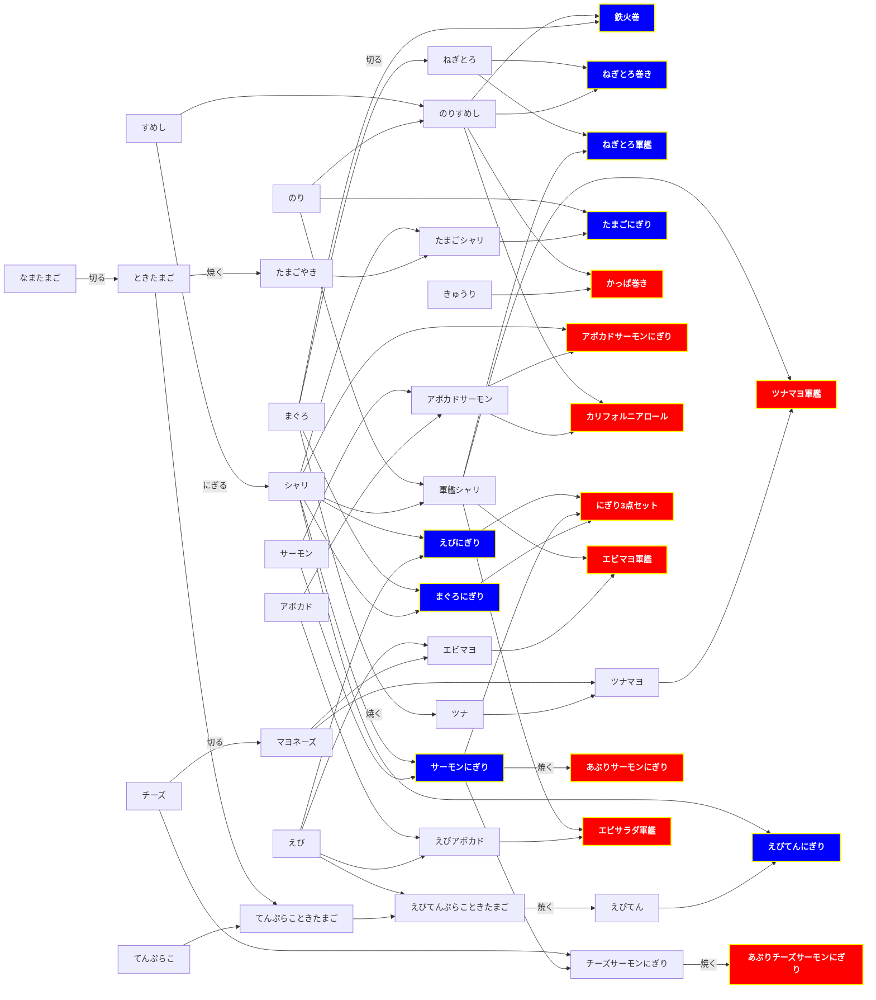
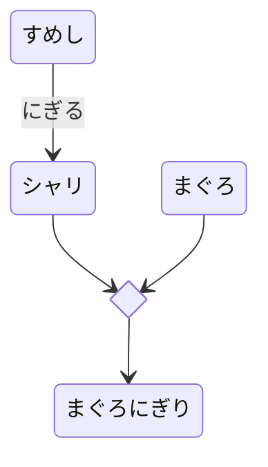
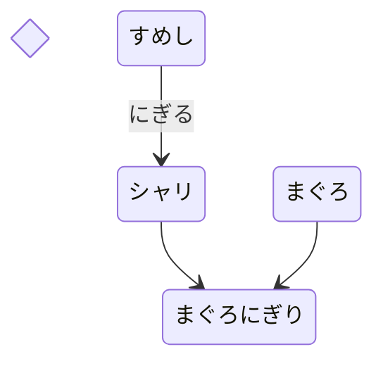
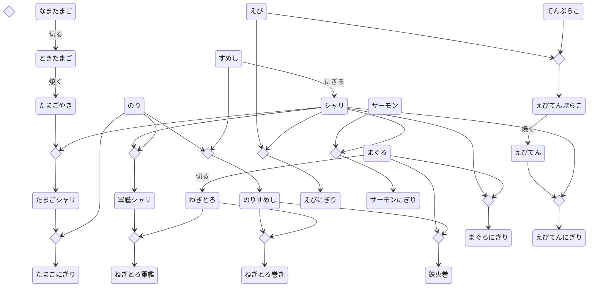

```mermaid
flowchart LR
classDef fin fill:#f00,color:white,font-weight:bold,stroke-width:2px,stroke:yellow
classDef fin2 fill:#00f,color:white,font-weight:bold,stroke-width:2px,stroke:yellow

のり-->のりすめし
すめし-->のりすめし
まぐろ-->B[鉄火巻]
のりすめし-->B[鉄火巻]
まぐろ-->|切る|ねぎとろ
のりすめし-->C[ねぎとろ巻き]
ねぎとろ-->C[ねぎとろ巻き]
すめし-->|にぎる|シャリ
シャリ-->軍艦シャリ
のり-->軍艦シャリ
軍艦シャリ-->A[ねぎとろ軍艦]
ねぎとろ-->A[ねぎとろ軍艦]
シャリ-->D[まぐろにぎり]
まぐろ-->D[まぐろにぎり]
えび-->E[えびにぎり]
シャリ-->E[えびにぎり]
サーモン-->F[サーモンにぎり]
シャリ-->F[サーモンにぎり]
てんぷらこ-->てんぷらこときたまご
ときたまご-->てんぷらこときたまご
てんぷらこときたまご-->えびてんぷらこときたまご
えび-->えびてんぷらこときたまご
えびてんぷらこときたまご-->|焼く|えびてん
えびてん-->G[えびてんにぎり]
シャリ-->G[えびてんにぎり]
なまたまご-->|切る|ときたまご
ときたまご-->|焼く|たまごやき
たまごやき-->たまごシャリ
シャリ-->たまごシャリ
たまごシャリ-->H[たまごにぎり]
のり-->H[たまごにぎり]
きゅうり-->I[かっぱ巻き]
のりすめし-->I[かっぱ巻き]
アボカド-->アボカドサーモン
サーモン-->アボカドサーモン
アボカドサーモン-->K[アボカドサーモンにぎり]
シャリ-->K[アボカドサーモンにぎり]
アボカドサーモン-->L[カリフォルニアロール]
のりすめし-->L[カリフォルニアロール]
D[まぐろにぎり]-->M[にぎり3点セット]
F[サーモンにぎり]-->M[にぎり3点セット]
E[えびにぎり]-->M[にぎり3点セット]
チーズ-->|切る|マヨネーズ
マヨネーズ-->エビマヨ
えび-->エビマヨ
エビマヨ-->N[エビマヨ軍艦]
軍艦シャリ-->N[エビマヨ軍艦]
まぐろ-->|焼く|ツナ
ツナ-->ツナマヨ
マヨネーズ-->ツナマヨ
ツナマヨ-->O[ツナマヨ軍艦]
軍艦シャリ-->O[ツナマヨ軍艦]
F[サーモンにぎり]-->|焼く|J[あぶりサーモンにぎり]
F[サーモンにぎり]-->チーズサーモンにぎり
チーズ-->チーズサーモンにぎり
チーズサーモンにぎり-->|焼く|P[あぶりチーズサーモンにぎり]
えび-->えびアボカド
アボカド-->えびアボカド
えびアボカド-->Q[エビサラダ軍艦]
軍艦シャリ-->Q[エビサラダ軍艦]

class A,B,C,D,E,F,G,H,I,J,K,L,M,N,O,P,Q fin
class A,B,C,D,E,F,G,H fin2

```

```mermaid
stateDiagram
state <6> <<choice>>
すめし-->シャリ:にぎる
シャリ--><6>
まぐろ--><6>
<6>-->まぐろにぎり
```

```mermaid
stateDiagram
state <6> <<choice>>
すめし-->シャリ:にぎる
シャリ-->まぐろにぎり
まぐろ-->まぐろにぎり
```

```mermaid
stateDiagram
state <1> <<choice>>
state <2> <<choice>>
state <3> <<choice>>
state <4> <<choice>>
state <5> <<choice>>
state <6> <<choice>>
state <7> <<choice>>
state <8> <<choice>>
state <9> <<choice>>
state <10> <<choice>>
state <11> <<choice>>
state <12> <<choice>>
state <13> <<choice>>
のり--><1>
すめし--><1>
<1>-->のりすめし
まぐろ--><2>
のりすめし--><2>
<2>-->鉄火巻
まぐろ-->ねぎとろ:切る
のりすめし--><3>
ねぎとろ--><3>
<3>-->ねぎとろ巻き
すめし-->シャリ:にぎる
シャリ--><4>
のり--><4>
<4>-->軍艦シャリ
軍艦シャリ--><5>
ねぎとろ--><5>
<5>-->ねぎとろ軍艦
シャリ--><6>
まぐろ--><6>
<6>-->まぐろにぎり
えび--><7>
シャリ--><7>
<7>-->えびにぎり
サーモン--><8>
シャリ--><8>
<8>-->サーモンにぎり
えび--><9>
てんぷらこ--><9>
<9>-->えびてんぷらこ
えびてんぷらこ-->えびてん:焼く
えびてん--><10>
シャリ--><10>
<10>-->えびてんにぎり
なまたまご-->ときたまご:切る
ときたまご-->たまごやき:焼く
たまごやき--><12>
シャリ--><12>
<12>-->たまごシャリ
たまごシャリ--><13>
のり--><13>
<13>-->たまごにぎり
```
